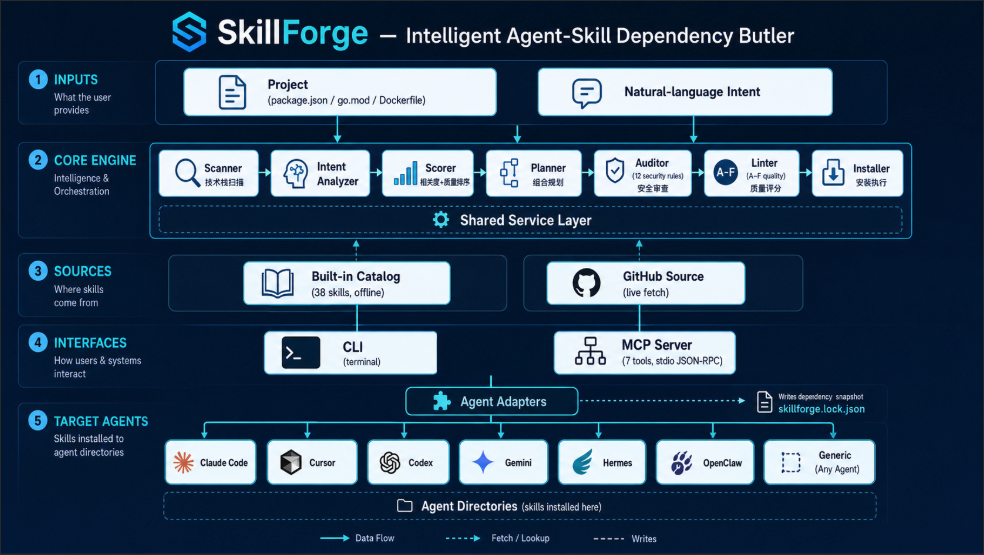
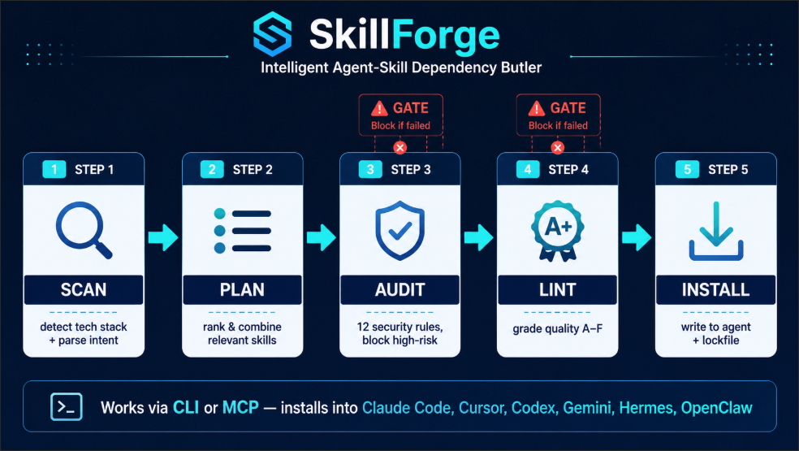

<div align="center">


# SkillForge

[](https://www.npmjs.com/package/skillforge-butler)
[](https://www.npmjs.com/package/skillforge-butler)
[](./LICENSE)
[](https://nodejs.org)

**English** · [简体中文](./README.zh-CN.md) · [日本語](./README.ja.md)

**The intelligent dependency butler for Agent Skills** — it reads your project
and intent, mines the open-source skill ecosystem, **security-audits** and
**quality-grades** each candidate, then installs a vetted combination into the
agent of your choice: Claude Code, Cursor, Codex, Gemini, Hermes, or OpenClaw.



</div>

SkillForge is not "another skill directory". It is an **orchestrator** that
turns a goal into installed, audited capabilities:

```
scan (tech stack) + intent (natural language)
        │
        ▼
   plan  ──►  audit  ──►  install  ──►  lockfile
 (rank +    (security    (per-agent    (auditable
  reasons)   gate)        adapter)      record)
```

## Why it exists

The Agent Skills ecosystem (built on the `SKILL.md` standard) exploded in
2025–2026: `anthropics/skills`, `vercel-labs/skills` (skills.sh),
`VoltAgent/awesome-agent-skills` (700+), and dozens more. But existing tooling
has gaps SkillForge closes:

1. **Discovery is keyword-only.** SkillForge infers needs from your *project*
   and a *natural-language goal*, then plans a combination — not just a search box.
2. **Nobody audits.** Skills can ship executable scripts and tool-use hooks.
   SkillForge runs a **static security audit** before anything touches disk and
   blocks high/critical risks by default.
3. **Multi-agent install is messy.** One discovery → install into any agent via
   pluggable adapters.
4. **No lifecycle.** SkillForge writes a `skillforge.lock.json` for auditability
   and update checks.

## How it compares

SkillForge sits between skill *registries* (catalogs you browse) and skill
*loaders* (runtime that loads SKILL.md). It is the only tool that combines
**intent-based planning + security audit + quality grading + multi-agent install**
in one pipeline.

| Capability | **SkillForge** | vercel `skills` (skills.sh) | `openskills` | `anthropics/skills` | awesome-skills lists |
|---|:--:|:--:|:--:|:--:|:--:|
| Search / discover skills | ✅ ranked | ✅ keyword | ➖ loader only | ➖ catalog | ✅ manual |
| Infer needs from **project tech stack** | ✅ `scan` | ❌ | ❌ | ❌ | ❌ |
| **Intent → skill combination** plan | ✅ `plan` | ❌ | ❌ | ❌ | ❌ |
| **Security audit** before install | ✅ 12 rules | ❌ | ❌ | ❌ | ⚠️ some lists score risk |
| **Quality grading** (A–F) | ✅ `lint` | ❌ | ❌ | ❌ | ❌ |
| Install into multiple agents | ✅ 7 targets | ✅ via `-a` | ✅ many | ➖ manual | ❌ |
| Self-installable **plugin** (skill + MCP) | ✅ | ✅ skill | ➖ | ✅ skill | ❌ |
| **MCP server** (agent-callable) | ✅ 7 tools | ❌ | ❌ | ❌ | ❌ |
| Lockfile / update checks | ✅ | ✅ | ➖ | ❌ | ❌ |
| Offline mode | ✅ | ❌ | ➖ | n/a | n/a |
| Runtime dependencies | 1 (`yaml`) | several | several | n/a | n/a |

Legend: ✅ first-class · ⚠️ partial · ➖ limited / indirect · ❌ none.

> SkillForge deliberately stands *on top of* these projects rather than
> replacing them: it can pull candidates from skills.sh / GitHub, reuses the
> `anthropics/skills` SKILL.md standard, and borrows progressive-disclosure
> ideas from `openskills`. Its unique value is the **planning + audit + quality**
> middle layer no other tool provides.

## Pipeline at a glance




```bash
npx skillforge-butler <command>   # CLI
npx -p skillforge-butler skillforge-mcp   # MCP server (for agents)
```

Or install globally (exposes the `skillforge`, `sf`, and `skillforge-mcp` bins):

```bash
npm install -g skillforge-butler
skillforge --help                 # or the `sf` alias
```

From source (development):

```bash
npm install        # install deps
npm run build      # compile to dist/
npm link           # expose `skillforge` / `sf` globally
# or run directly:
node dist/cli.js <command>
npm run dev -- <command>
```

## Quick start

```bash
# 1. See what your project needs
sf scan

# 2. Get a vetted recommendation for a goal (no install)
sf plan "build a cross-border e-commerce site with payments and i18n" --dry-run

# 3. Do it all — scan, plan, audit, and install into Claude Code
sf auto "build a cross-border e-commerce site with payments and i18n" --agent claude-code

# 4. Vet any third-party skill before trusting it
sf audit some-owner/some-repo/skills/their-skill

# 5. Search the ecosystem
sf search "playwright e2e testing"
```

## Commands

| Command | Purpose |
|---|---|
| `sf scan` | Detect tech stack → capability needs |
| `sf search "<query>"` | Rank skills by relevance + quality (installs/stars/reputation) |
| `sf plan ["<intent>"]` | Recommend a skill combination with reasons + conflict detection |
| `sf audit <id\|--dir path>` | Static security audit of a skill |
| `sf lint <id\|--dir path>` | Quality-grade a skill (A–F) against authoring conventions |
| `sf install <id> --agent <a>` | Audit + install one skill |
| `sf auto ["<intent>"]` | Full pipeline: scan → plan → audit → install |
| `sf list` | Show installed skills from the lockfile |
| `sf update` | Check installed skills for upstream changes |
| `sf init <name>` | Scaffold a new `SKILL.md` |

Run `sf help` for all options.

## The security audit

SkillForge's differentiator. The static auditor (`src/core/auditor.ts`) flags,
among others:

| Rule | Risk | Catches |
|---|---|---|
| `curl \| sh` | critical | remote code execution one-liners |
| base64 → shell | critical | obfuscated payloads |
| `rm -rf` | high | destructive deletes |
| `sudo` | high | privilege escalation |
| sensitive files | high | `.env`, `id_rsa`, `~/.ssh`, credentials |
| outbound requests | high | possible data exfiltration |
| tool-use hooks | high | `PreToolUse`/`PostToolUse` registration |
| home-dir writes | medium | global config tampering |
| `chmod 777` | medium | permission weakening |
| persistence | medium | crontab / launchd / systemd |
| URL shorteners | low | ephemeral exfil endpoints |

Findings of **high** or **critical** block installation unless you pass
`--force` (with explicit confirmation) or `--skip-audit`.

## The quality gate

While the audit answers "is it safe?", the **linter** (`src/core/linter.ts`)
answers "is it good?". `sf lint` grades a skill **A–F** (0–100) against
AgentSkills authoring conventions and content-quality heuristics:

- frontmatter completeness (name format, description present)
- description clarity and **triggering** ("Use when…") — critical for the agent
  deciding when to load the skill
- body structure (When to use / Instructions / Examples), headings, examples
- bloat / thinness (context-cost aware)
- leftover `TODO`/placeholder text, name-echoing descriptions, placeholder links

Quality gating is wired into install: pass `--min-quality <0-100>` to refuse
skills scoring below your bar (overridable with `--force`). The built-in catalog
is held to this bar — all 38 entries grade **B or higher**.


SkillForge ships as a **multi-agent plugin**. One command registers its MCP
server and copies the `skillforge` skill into the agent of your choice:

```bash
# Install into a specific agent (skill + MCP server)
sf plugin install --agent claude-code
sf plugin install --agent hermes --global
sf plugin install --agent openclaw
sf plugin install --agent cursor

# Preview without writing anything
sf plugin install --agent codex --dry-run

# See where it's installed / remove it
sf plugin status
sf plugin uninstall --agent cursor
```

What `plugin install` does, per agent:

1. Copies the `skillforge` skill folder (with full CLI docs) into the agent's
   skills directory.
2. Merges a `skillforge` MCP server entry into the agent's config — preserving
   existing content and writing a `.skillforge-backup` of the original.

| Agent | Skill goes to | MCP config touched |
|---|---|---|
| Claude Code | `.claude/skills/skillforge/` | `.mcp.json` (project) / `~/.claude/settings.json` (global) |
| Hermes (Nous) | `.hermes/skills/skillforge/` | `~/.hermes/config.yaml` (`mcp_servers`) |
| OpenClaw | `.openclaw/skills/skillforge/` | `~/.openclaw/openclaw.json` (`mcp`) |
| Cursor | `.cursor/skills/skillforge/` | `.cursor/mcp.json` |
| Codex | `.codex/skills/skillforge/` | `.codex/config.toml` (`[mcp_servers.skillforge]`) |
| Gemini CLI | `.gemini/skills/skillforge/` | `.gemini/settings.json` |
| Generic | `.skills/skillforge/` | `.skills/mcp.json` |

### Claude Code marketplace

This repo is also a Claude Code plugin marketplace (`.claude-plugin/`):

```
/plugin marketplace add <path-or-git-url>
/plugin install skillforge
```

## MCP server

`skillforge-mcp` is a zero-dependency MCP server (stdio) exposing SkillForge to
any MCP-capable agent. Tools: `skillforge_scan`, `skillforge_search`,
`skillforge_plan`, `skillforge_audit`, `skillforge_install`, `skillforge_list`.

```bash
# Register manually in any mcpServers-style config:
{ "mcpServers": { "skillforge": { "command": "npx", "args": ["-y", "-p", "skillforge-butler", "skillforge-mcp"] } } }
```

The agent calls these tools directly — no shelling out. When MCP isn't
available, the bundled skill documents the equivalent `skillforge` CLI commands,
so **CLI and skill work together**: the skill teaches the agent both paths.

## Target agents (where installed skills go)

The `install` command (for installing *other* skills) writes to:

| `--agent` | Installs to (project scope) |
|---|---|
| `claude-code` (default) | `.claude/skills/<name>/` |
| `cursor` | `.cursor/skills/<name>/` |
| `codex` | `.codex/skills/<name>/` |
| `gemini` | `.gemini/skills/<name>/` |
| `generic` | `.skills/<name>/` |

Add `--global` (`-g`) to install at the user scope (under your home directory).

## Offline & online

- **Offline** (`--offline`): uses only the built-in curated catalog
  (`catalog/catalog.json`) and synthesizes a `SKILL.md` stub from metadata.
  `scan`, `audit`, `plan`, and local installs all work with zero network.
- **Online** (default): the GitHub source fetches the real upstream skill files
  verbatim. Set `GITHUB_TOKEN` to avoid API rate limits.

## Optional LLM enhancement

If `SKILLFORGE_LLM_API_KEY` (or `OPENAI_API_KEY`) is set, intent analysis is
refined by an OpenAI-compatible model. Without a key, a fully offline heuristic
analyzer is used. Configure via:

```
SKILLFORGE_LLM_API_KEY   # enables LLM refinement
SKILLFORGE_LLM_BASE_URL  # default https://api.openai.com/v1
SKILLFORGE_LLM_MODEL     # default gpt-4o-mini
```

## Use it as a meta-skill

`skill/SKILL.md` lets any SKILL.md-compatible agent invoke SkillForge itself —
so an agent can discover and install skills on demand. Install it like any other
skill, or point your agent at this repo.

## Architecture

```
src/
  cli.ts                 # command router + help
  cli/                   # arg parsing, prompts, rendering, command impls
  core/
    scanner.ts           # project tech-stack detection
    intent.ts            # NL intent → capability needs (offline)
    llm.ts               # optional LLM refinement
    scorer.ts            # relevance + quality ranking
    planner.ts           # greedy combo selection + conflict detection
    auditor.ts           # static security audit (the differentiator)
    installer.ts         # audit-gated install
    lockfile.ts          # skillforge.lock.json
    registry.ts          # source wiring + materialization
  sources/
    source.ts            # Source interface + registry
    catalogSource.ts     # built-in curated catalog (offline)
    githubSource.ts      # fetch real skill files from GitHub
  agents/
    adapter.ts           # per-agent install path adapters
  core/service.ts        # shared service layer (used by CLI + MCP)
  mcp/
    server.ts            # zero-dep MCP server over stdio
    tools.ts             # skillforge_* MCP tool definitions
  mcp.ts                 # `skillforge-mcp` entry point
  plugin/
    manifests.ts         # per-agent integration descriptors
    mcpConfig.ts         # merge/remove MCP entries (JSON + YAML)
    installer.ts         # copy skill + register MCP per agent
catalog/catalog.json     # curated, vetted skill index
skill/SKILL.md           # SkillForge as an installable meta-skill (+ CLI docs)
.claude-plugin/          # Claude Code plugin + marketplace manifests
  plugin.json
  marketplace.json
```

## How this integrates the existing ecosystem

SkillForge deliberately stands on top of existing work rather than re-indexing
the world:

- **`anthropics/skills`** — authoritative catalog entries; the `SKILL.md` standard.
- **`vercel-labs/skills` (skills.sh)** — command style aligned with `find`/`add`;
  a future remote source.
- **`VoltAgent/awesome-agent-skills`** — breadth of candidates.
- **`numman-ali/openskills`** — progressive-disclosure / multi-agent loader ideas.
- **arXiv 2603.11808 (dense-retrieval mining)** — the blueprint for the matching
  layer (MVP uses a lightweight lexical+quality scorer; vector retrieval is a
  documented next step).
- **awesome-skills.com risk scoring** — inspiration for the audit dimensions.

## Development

```bash
npm test           # run the vitest unit suite
npm run test:e2e   # run the end-to-end CLI/MCP/plugin suite
npm run test:all   # unit + e2e
npm run lint       # type-check only
npm run build      # compile to dist/
```

## Publishing

```bash
npm pack --dry-run   # inspect exactly what ships
npm publish          # runs build + tests via prepublishOnly, then publishes
```

The published package ships only `dist/`, `catalog/`, `skill/`, `.claude-plugin/`,
`README.md`, and `LICENSE` (see `files` in package.json + `.npmignore`). It
exposes three bins: `skillforge`, `sf`, and `skillforge-mcp`.

## License

MIT

